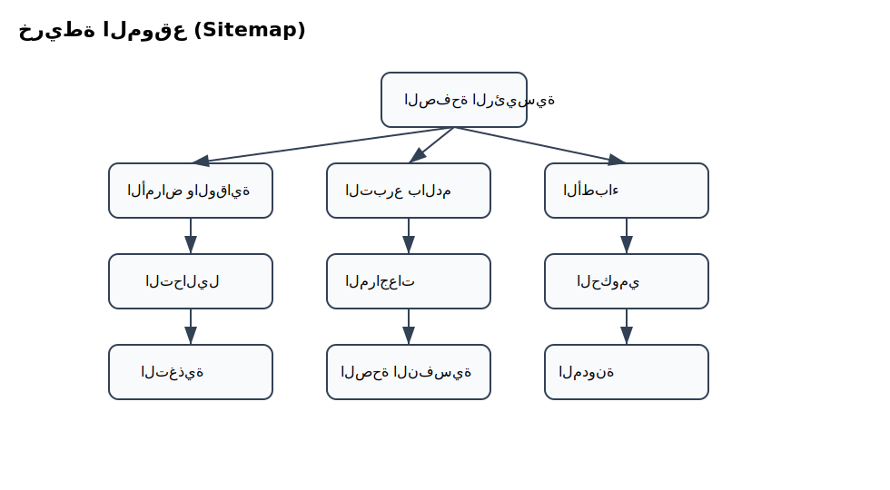
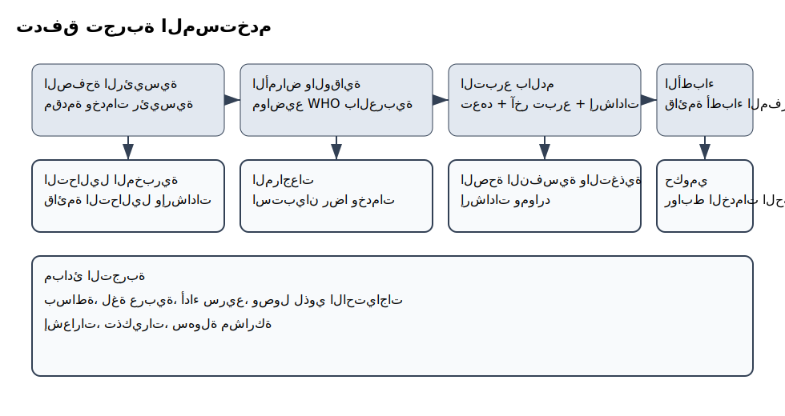
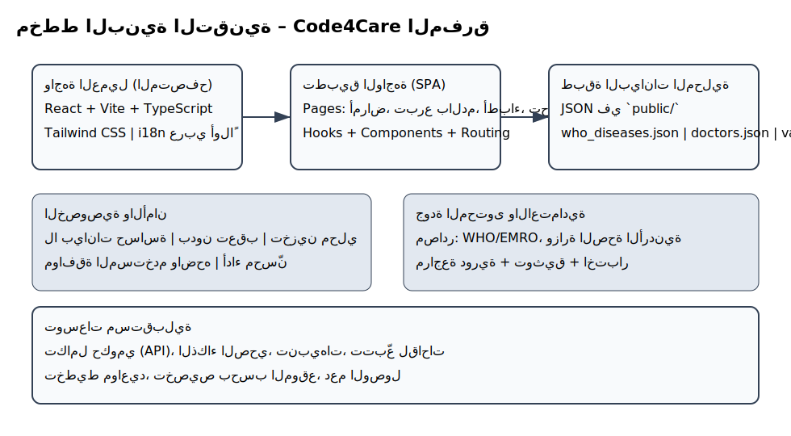
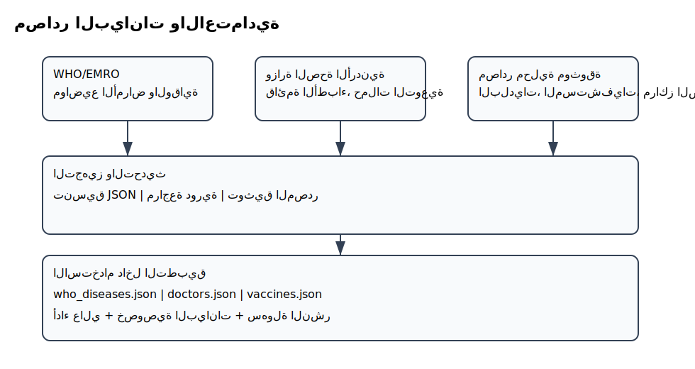

# بروتوتايب تفصيلي لمسابقة الابتكار الصحي – Code4Care المفرق

## مهم يوجد صور للمخطتات في قسم docs/ images 

## الملخص التنفيذي
نحن فريق Code4Care في محافظة المفرق، نعمل على حل مشكلة الازدحام في المستشفيات والعيادات من خلال منصة عربية تُسهّل الوصول إلى المعلومات الصحية والخدمات المحلية بشكل موثوق وميسر. يوفر الموقع 12 قسماً متكاملاً يضم تفاصيل المرافق الصحية في المفرق، بما في ذلك بنوك الدم ومراكز التبرع، والعيادات، والمستشفيات، والمختبرات الصحية، مع محتوى توعوي ومصادر رسمية.

يمكّن الموقع المرضى من الاطلاع على تفاصيل المرافق والخدمات المتاحة، ثم حجز المواعيد بطريقة منظمة باستخدام بياناتهم الشخصية والصحية. يهدف هذا إلى تقليل الازدحام وتحسين تجربة تلقي الخدمة من خلال تنظيم الحجز، عرض المعلومات بشكل واضح، وتسهيل التواصل بين المرضى ومقدمي الرعاية.

## المشكلة والفرصة
- نقص منصات عربية محلية تجمع الخدمات الصحية بشكل عملي ومتناسق.
- صعوبة الوصول لمواقع التبرع بالدم، جداول اللقاحات، ومعلومات الأمراض الموثوقة.
- الحاجة إلى تجربة مبسطة تدعم العربية أولاً وتعمل بسلاسة على الأجهزة منخفضة الإمكانات.

## الجمهور المستهدف
- سكان المفرق: المرضى، العائلات، المتطوعون، الطلبة.
- مقدمو الرعاية: أطباء، مختبرات، بنوك دم، جمعيات.
- صناع القرار المحليون الراغبون في مؤشرات صحية مجتمعية.

## القيمة المضافة
- محتوى عربي موثوق مرتبط بمصادر WHO ووزارة الصحة الأردنية.
- خدمات عملية: إدارة التبرع بالدم، استعراض الأطباء، مراجعات المستخدمين، التثقيف.
- أداء سريع، واجهة مبسطة، إمكانية العمل دون اتصال جزئياً عبر بيانات محلية.

## المزايا الأساسية

### تفصيل أقسام المشروع
يشرح هذا القسم الصفحات الرئيسية وما تقدمه للمستخدم:

- الرئيسية: عرض بطاقات الخدمات، دعوة واضحة للفعل، روابط سريعة للأقسام.
- الأمراض والوقاية: تبويب معدية/غير معدية/تطعيمات، بحث، صفحة تفاصيل لكل مرض، مصادر `public/who_diseases.json` و`public/vaccines.json`.
- الأطباء: قائمة من `public/doctors.json` مع تخصص/موقع/تأمين، دعوة لحجز أو تواصل.
- التحاليل المخبرية: إرشادات قراءة النتائج لـ `CBC`، السكر، الدهون، عرض نطاقات طبيعية وملاحظات.
- التبرع بالدم: معلومات الأهلية والشروط، بنوك الدم المحلية، حملات مجتمعية وروابط تواصل.
- الخدمات الحكومية: روابط رسمية للتطعيمات، التأمين الصحي، الشكاوى، والمواعيد.
- المستشفيات: عرض المستشفيات الحكومية والخاصة في المفرق مع الموقع ووسائل التواصل.
- الصحة النفسية: إرشادات مبسطة، موارد دعم وخطوط مساعدة (إن وجدت).
- التغذية واللياقة: نصائح عملية مدعومة بمراجع، روابط لتتبّع عادات صحية.
- المراجعات: مشاركة تجارب المستخدمين بشكل مسؤول مع إخلاء مسؤولية واضح.
- التداوي عن بعد: معلومات عامة وروابط منصات موثوقة.
- الذكاء الصحي: عرض أفكار مستقبلية بحذر وأخلاقيات استخدام الذكاء الاصطناعي.
- الوظائف: روابط فرص عمل صحية محلية وإقليمية.
- المدونة: مقالات متعمقة قابلة للتحديث الدوري، نسب مصادر داخل المحتوى.

ملاحظات تنفيذية:
- مصادر البيانات الأساسية: `public/who_diseases.json`, `public/vaccines.json`, `public/doctors.json`.
- لا تُجمع بيانات شخصية، ويجري نسب المصادر داخل الواجهة مع إخلاء مسؤولية.
- تنظيم الصفحات مبني على ملفات ضمن `src/pages` لضمان فصلٍ واضح لكل قسم.

- الأمراض والوقاية: تبويب أمراض، لقاحات، مصادر WHO و EMRO، معلومات موثوقة.
- التبرع بالدم: نموذج انضمام، تعهد بالتبرع، قائمة مواقع محلية ثابتة، إحصاءات.
- الأطباء: عرض معلومات من ملف `public/doctors.json` مع تحديثات مستقبلية.
- التحاليل المخبرية: إرشادات ونصائح عامة، تنظيم معلومات.
- المراجعات: إضافة وحذف مراجعات، إحصاءات فورية.
- الصحة النفسية والتغذية واللياقة: صفحات محتوى مختصر قابل للتوسع.

## تجربة المستخدم

- عربي بالكامل، اتجاه RTL، خطوط واضحة، تبويب سلس.
- دعم الأجهزة المحمولة أولاً، تصاميم خفيفة، أخطاء ورسائل نجاح باللغة العربية.
- تقليل التمرير الزائد، إخفاء سكرول حيث يلزم مع استمرار السحب باللمس.

## البنية التقنية

- الواجهة: React + Vite + Tailwind، مكونات UI خفيفة.
- البيانات: `public/*.json` لمصادر WHO واللقاحات والأطباء.
- إدارة الحالة: React hooks محلية لكل صفحة.
- الأداء: HMR أثناء التطوير، بناء إنتاجي خفيف.
- الخصوصية: تخزين محلي لبعض النماذج (تعهدات، مراجعات)، دون بيانات حساسة.

## المصادر والاعتمادية

- WHO/EMRO: صفحات موثوقة للأمراض واللقاحات (تم تصحيح الروابط المكسورة).
- وزارة الصحة الأردنية: ملفات PDF وخطط لقاحات محدثة.
- سياسة المصادر: ذكر المصدر وروابطه في الواجهة.

## معايير الجودة
- سهولة الاستخدام: زمن مهمة رئيسية < 30 ثانية.
- الأداء: LCP < 2.5s على اتصالات 3G الجيدة.
- الصحة والموثوقية: كل معلومة مرتبطة بمصدر رسمي.
- الوصولية: تباين عالٍ، دعم قارئ الشاشة، عناصر قابلة للتركيز.

## خارطة الطريق (3 أشهر)
- الشهر 1: تحسين صفحات الأمراض واللقاحات، استخراج جداول جرعات الأردن بالتفصيل.
- الشهر 2: توسيع التبرع بالدم: حملات محلية، تنبيهات بالمواعيد، تحسين الإحصاءات.
- الشهر 3: تكامل الأطباء والعيادات: تصفية، حجوزات مبدئية (غير ملزمة)، تحسين المراجعات.

## معالم رئيسية
- M1: نسخة عربية مستقرة مع مصادر WHO صحيحة.
- M2: جداول لقاحات الأردن كاملة بالأعمار والفئات الخاصة.
- M3: لوحة مؤشرات تبرع بالدم للمفرق.
- M4: دليل الأطباء مع تصفية وخرائط.

## مؤشرات النجاح
- عدد المستخدمين النشطين أسبوعياً.
- عدد التعهدات بالتبرع وتفاعل المجتمع.
- زمن الوصول للمعلومة (عدد النقرات).
- رضا المستخدم عبر مراجعات إيجابية.

## المخاطر وخطط التخفيف
- الروابط الخارجية تتغير: آلية تحقق دورية وتحديثات تلقائية للروابط.
- دقة بيانات محلية: تعاون مع الجهات الرسمية والمجتمع.
- عبء التطوير: تقسيم المهام وتبسيط المكونات.

## الحوكمة والامتثال
- احترام الخصوصية: عدم جمع بيانات حساسة دون موافقة.
- الامتثال للمصادر: نسب المعلومات والروابط بوضوح.
- الشفافية: كود مفتوح المصدر قابل للتدقيق.

## خطة الاستدامة
- مجتمع محلي يدعم المحتوى ويبلغ عن التحديثات.
- شراكات مع جمعيات صحية ومدارس.
- إمكانية رعاية محلية لميزات محددة.

## خطة العرض للمسابقة
- عرض حي: صفحات الأمراض/اللقاحات، التبرع بالدم، الأطباء، المراجعات.
- إبراز تصحيح الروابط، العربية أولاً، سرعة الواجهة.
- قصص استخدام: أم/طالب/متطوع وكيف يتنقلون ويستفيدون.

## المتطلبات المستقبلية المقترحة
- مرشحات حسب الحالات الصحية، وإشعارات للتطعيمات.
- تمييز لقاحات إلزامية/اختيارية، وتغطية فئات خاصة.
- تكامل خرائط محلية لبنوك الدم بمصدر موثوق.